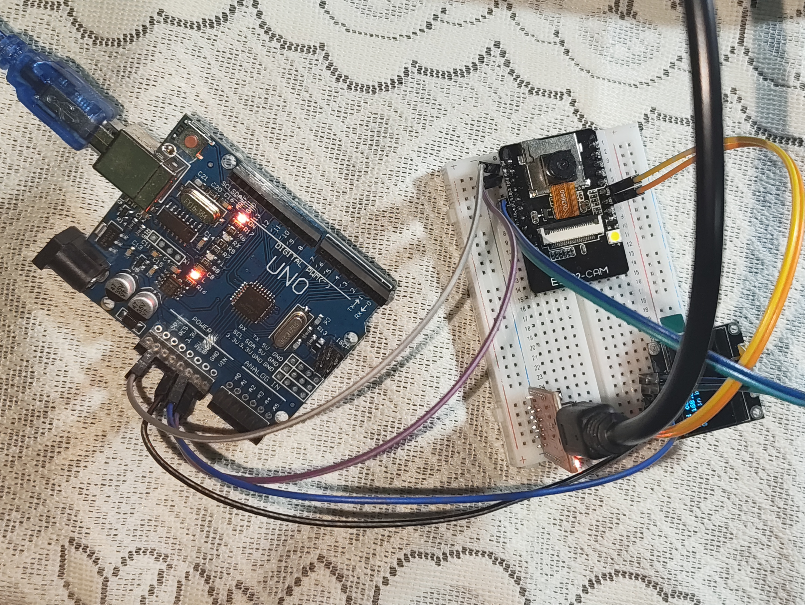
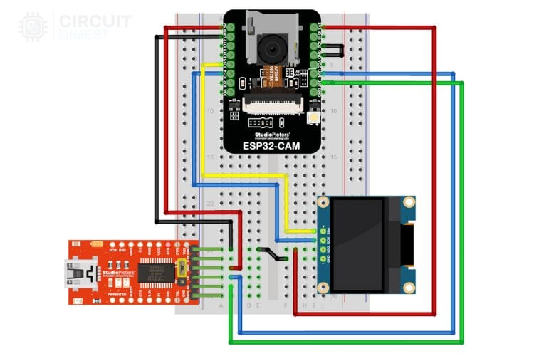
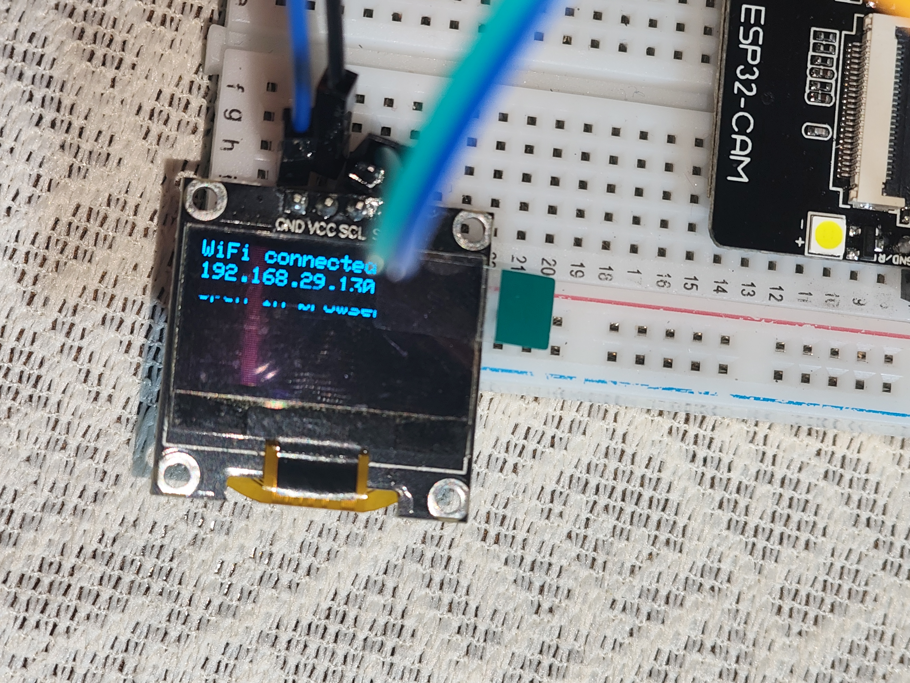

# ESP32-CAM Smart Object Detection with OLED Feedback

## 📌 Overview

This project implements a real-time object detection system using an ESP32-CAM module and an OLED display. The ESP32-CAM captures images, processes them using a trained object detection model, and displays the detected object along with its confidence score on the OLED display. The system also provides a web interface for monitoring and controlling the detection process.

---

## 🎯 Project Objective

The objective of this project is to demonstrate how machine learning can be deployed on resource-constrained embedded devices for real-time object detection without relying on cloud processing.

---

## 🛠 Hardware Components

- ESP32-CAM
- OLED Display (SSD1306)
- FTDI Programmer
- Breadboard
- Jumper Wires
- Arduino IDE

---

## 🔌 Hardware Setup



**Figure 1:** Complete hardware setup consisting of ESP32-CAM, OLED display, FTDI programmer, breadboard, and jumper wire connections.

---

## 🧩 Circuit Diagram



**Figure 2:** Circuit connections used for interfacing the ESP32-CAM with the OLED display and FTDI programmer.

---

## 🌐 WiFi Connection



**Figure 3:** OLED display showing successful WiFi connection and the assigned IP address.

---

## 💻 Web Dashboard


**Figure 4:** Web dashboard used to start the object detection process.

---

## 📹 Live Camera Feed


**Figure 5:** Live camera feed displayed while object detection is active.

---

## ⌚ Detection Input Example


**Figure 6:** Sample object presented to the ESP32-CAM for detection.

---

## 📺 OLED Detection Output


**Figure 7:** OLED display showing the detected object label and confidence score.

---

## ⚙ System Workflow

```text
ESP32-CAM
     ↓
Capture Image
     ↓
Object Detection Model
     ↓
Object Classification
     ↓
Confidence Score
     ↓
OLED Display Output
```

---

## ✨ Features

- Real-time object detection
- ESP32-CAM based implementation
- OLED display integration
- WiFi-enabled monitoring
- Lightweight embedded AI solution
- Low-cost hardware design
- Web-based control interface

---

## 📚 Technologies Used

- C++
- Arduino IDE
- ESP32-CAM
- OLED SSD1306
- TinyML
- Computer Vision
- Embedded Systems
- WiFi Networking

---

## 🚧 Challenges Faced

- Memory limitations on ESP32-CAM
- Optimizing inference performance
- OLED display integration
- Maintaining stable WiFi connectivity
- Improving image quality for accurate detection

---

## 📈 Future Improvements

- Support for multiple object classes
- Mobile application integration
- Cloud dashboard support
- Push notifications
- Improved detection accuracy

---

## 👨‍💻 Author

**Amrit Gurung**

BCA Cybersecurity Student

GitHub: https://github.com/nakiz0

---